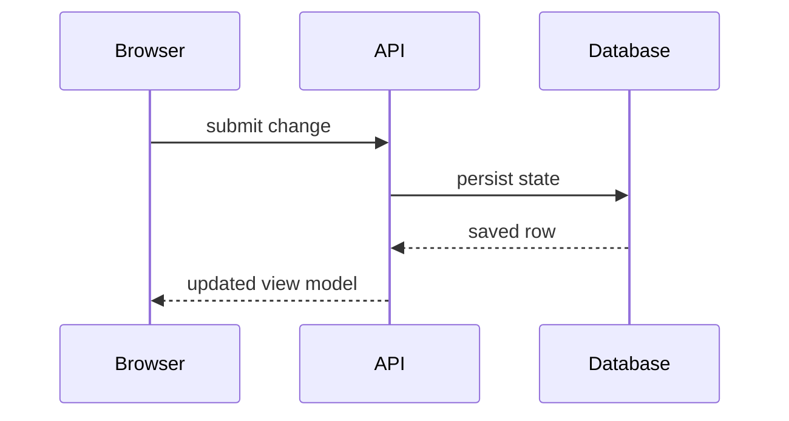

# TDD Phase

You are creating a Technical Design Document. The TDD explains how the agreed product behavior will be built. Product requirements and user experience belong upstream; this phase handles architecture, interfaces, data movement, code shape, and technical tradeoffs.

Run the TDD as an interview with two ordered phases:

1. System Design: behavior across components, services, endpoints, stores, queues, workers, and external systems.
2. Program Design: the code shape inside those components, including call paths, modules, interfaces, dependency boundaries, and tests.

System Design must be approved before Program Design begins. Within each phase, ask one decision at a time and rework the artifact after each resolved decision.

## Conversation Rules

- Ask exactly one question in each message. Two or three options inside that question are allowed; multiple independent questions are not.
- Present the decision, tradeoffs, and recommendation, then wait.
- Treat user pushback and clarifying questions as conversation. Do not patch the TDD until the decision is resolved.
- When a decision resolves, rework the affected section rather than appending notes.
- The TDD should read as a cohesive design at every point, not a running list of answers.
- Use diagrams, type signatures, endpoint shapes, file trees, call trees, or pseudocode instead of prose when they clarify the decision.
- Use the smallest useful set of representations. This document should give leverage, not exhaustive implementation detail.
- If engineering constraints alter scope or UX, make that product impact explicit and revise the PRD or mockups when they exist.

## bb Task Setup

0. Call `hl_task_context` before reading files, spawning child threads, or choosing an artifact path. Use its task directory, task slug, artifact manifest, repository, branch, thread id, provider, and model preferences. If it fails, stop.
1. Use the task directory returned by the tool. Do not guess a sibling under `.humanlayer/tasks` from an old session or a remembered slug.
2. Locate this installed skill through the skills tier listing, then read reference files relative to this skill directory: `references/tdd_template.md`, `references/artifact_template.html`, `references/tdd_final_answer.md`, `references/tdd_final_answer.md`.
3. After every artifact write or edit, call `hl_artifact_save` with the relative file name and keep the returned `::hl-artifact{...}` directive for the final answer.

## Step 1: Understand the context

<instructions>

- List the task directory with `ls -La <task-dir>`.
- Read relevant task artifacts fully, excluding research-question artifacts.
- Read PRD if present, otherwise fall back to task or ticket, research, and design discussion.
- Read every user-mentioned file fully.
- Read `references/tdd_template.md` before creating the artifact.

</instructions>

<guidance>

## Working from whatever inputs exist

A PRD is helpful but not required. The design may start from a ticket and research or from a short request with codebase context.

- Cite the inputs you have rather than duplicating them.
- If product requirements are thin, ask targeted questions instead of inventing scope.
- The TDD answers how to build the behavior described upstream.
- When technical reality changes product behavior, make that implication explicit.

</guidance>

## Step 2: Write the skeleton

Write `NN-tdd-<slug>.md` in the task directory. Use `hl_next_artifact_number` and the template frontmatter fields.

The initial skeleton should contain only:

- Frontmatter with `type: design-tdd`, task, repo, branch, and sha.
- A title.
- Empty System Design and Program Design sections.
- A Patterns to Follow header.
- What We're Not Doing only if there is already a meaningful technical non-goal.

Save it with `hl_artifact_save`, then ask the first system-design question. Use one short orienting line and one decision question with options.

## Step 2b: First system-design question

The first question should open the largest unresolved architectural branch, not a small implementation preference. Use the upstream context to choose the right first branch:

- If the task is mostly backend behavior, start with where the behavior runs and what boundary owns it.
- If the task crosses UI and server, start with the user action and the request or event it produces.
- If persistence is central, start with state ownership and migration risk.
- If the work is a reliability or DevOps change, start with the control loop, failure mode, and rollback path.
- If the task is a UI-only feature, start with component responsibility and state flow, while still keeping product requirements upstream.

Ask one question with options and a recommendation. Save only the skeleton before asking; do not pre-fill the answer you want.

## Step 3: System Design

Design how the system changes across boundaries. Explain existing behavior and target behavior in the System Design section itself.

For each system-design decision:

1. Ask one question.
2. Present options with tradeoffs and a recommendation.
3. Use a representation that fits: Mermaid sequence or flow diagram, endpoint shape, message contract, data contract, high-level type signature, or focused HTML artifact.
4. Wait until the decision is resolved.
5. Rework the System Design section so the new decision is integrated.

### System Design representations

Use Mermaid for interactions, control flow, and data flow:



Use high-level signatures for boundary contracts:

```text
createResource(input: CreateResourceInput) -> Resource
```

Use endpoint or message shapes for transport boundaries:

```text
PUT /resources/:id
  request:  { enabled: boolean }
  response: { resource: Resource }
```

Use data contracts when the shared schema is the important decision. Match the codebase's schema style instead of forcing raw SQL.

### HTML artifacts for complex system concepts

When one concept needs combined annotations, side-by-side shapes, color, or layout, write a focused HTML artifact in the task directory as `diagram-<description>.html`. Read `references/artifact_template.html` first and use its small set of classes. Display it with a `::hl-artifact{...}` embed.

## Step 4: System Design review gate

When the cross-component design is settled, stop and ask the user to review the System Design section top to bottom before moving on. Incorporate fixes. Do not begin Program Design until the user approves System Design.

## Step 5: Program Design

Design the in-code shape under Program Design. Almost every program-design question should include a code-shape block, because the user is choosing between concrete implementation shapes.

For each program-design decision:

1. Ask one question.
2. Show options as call-stack trees, component trees, file ownership changes, dependency maps, method signatures, or pseudocode.
3. Recommend one option based on codebase conventions and implementation risk.
4. Wait until the decision is resolved.
5. Rework Program Design and Patterns to Follow so the artifact stays current.

### Program Design views

Call-stack tree for orchestration:

```text
entrypoint
  runCommand
    validateInput
    saveRecord
    publishResult
```

Frontend component tree for UI work:

```tsx
<InvoiceConsole> (apps/admin/src/routes/invoices.tsx)
  useInvoiceFilters()
  <InvoiceActionBar>
    <SendReminderDialog />
```

File-tree diff for ownership changes. Use proper tree glyphs when showing trees: `├──`, `└──`, and `│`. Inside diff fences, use `+` for additions or changed ownership, `-` for removals, and a leading space for context.

```diff
 src/
 └── resource/
+    ├── resource-client.ts      + owns API calls
+    └── resource-route.tsx      ~ wires UI action
```

Dependency maps for seams:

```text
createResourceWorkflow
  receives resourceStore  -> persists records
  receives clock          -> makes timestamps deterministic
```

Use pseudocode for important logic when real code would over-specify the implementation.

## Program Design Quality Bar

Program Design is not a task list. It is the smallest useful map of the code shape that lets the user decide whether the implementation direction is right before an implementer opens files. Keep it concrete and selective.

Use these views when they answer the current decision:

- **Call-stack tree** for backend commands, workers, services, event handlers, CLIs, or orchestration. Show the important calls and ownership boundaries, not every frame.
- **Frontend component tree** for UI work. Include production component names, state hooks, provider boundaries, and the package or route where the component lives.
- **File-tree diff** when file responsibility is itself a design decision. Keep the tree shallow and annotate changed files with the behavior they own.
- **Dependency map** when the main risk is coupling, testability, or injected capabilities. Name the dependency and the reason the receiving object needs it.
- **Internal signatures** when a new helper, command, hook, event, or contract is the clearest way to discuss the code shape.
- **Pseudocode** when an algorithm, retry path, concurrency guard, or validation flow matters but real code would over-specify details that belong in implementation.

Program-design questions should usually show two or three concrete shapes side by side. For example, do not ask whether validation should live in the route or domain layer as prose only; show the call path for each option and explain the tradeoff. A program-design message without a code block should be unusual.

When you update the artifact after a resolved program decision:

1. Rewrite the affected subsection under Program Design.
2. Update any call tree, file tree, signature, or dependency map that decision invalidates.
3. Add or adjust Patterns to Follow with verified local examples.
4. If the decision invalidates a System Design contract, update that section too.
5. If the decision changes product behavior, update or flag the PRD impact before continuing.

Do not turn Program Design into the detailed implementation plan. Leave step-by-step edits, phase ownership, and exhaustive verification commands for the structure outline and plan.

## Step 6: Program Design review gate

When the code shape is settled, stop and ask the user to review the Program Design section. Incorporate fixes before wrapping up.

## Program Design review gate details

When the Program Design section is complete, stop and ask for a top-to-bottom review. The user has seen the design arrive decision by decision; they still need a chance to read the finished code shape as one document.

Use this gate to catch:

- A module boundary that looked fine locally but is awkward in the full design.
- A dependency or API shape that hides too much behavior from tests.
- A code path that implements the product requirement but creates a migration, rollout, or observability problem.
- A diagram or call tree that no longer matches the prose after later decisions.
- A PRD or mockup implication that was discovered during technical design.

If the user raises fixes, apply them and save the artifact again. Do not read the final answer template until the user approves both System Design and Program Design.

## Step 7: Wrap up

When both System Design and Program Design are approved:

- Save the TDD with `hl_artifact_save`.
- Read `references/tdd_final_answer.md`.
- Follow the template exactly. It points to the structure outline.
- Include the saved artifact directive.

Use child threads only when a missing fact would change the artifact. Spawn independent assignments first, then wait for them and read their final messages:

```text
bb thread spawn --project $BB_PROJECT_ID --parent-self --environment $BB_ENVIRONMENT_ID --provider <same> --model <research model from hl_task_context preferences> --prompt "/rpi-agent-codebase-locator <assignment>"
bb thread spawn --project $BB_PROJECT_ID --parent-self --environment $BB_ENVIRONMENT_ID --provider <same> --model <research model from hl_task_context preferences> --prompt "/rpi-agent-codebase-analyzer <assignment>"
bb thread spawn --project $BB_PROJECT_ID --parent-self --environment $BB_ENVIRONMENT_ID --provider <same> --model <research model from hl_task_context preferences> --prompt "/rpi-agent-codebase-pattern-finder <assignment>"
bb thread spawn --project $BB_PROJECT_ID --parent-self --environment $BB_ENVIRONMENT_ID --provider <same> --model <research model from hl_task_context preferences> --prompt "/rpi-agent-web-search-researcher <assignment>"
bb thread wait <thread-id>
bb thread output <thread-id>
```

Role mapping: locator finds files and tests, analyzer explains current behavior, pattern finder finds local precedents, and web researcher checks external behavior or current documentation. The child thread's final message is the deliverable. Use only findings you have read from `bb thread output`.

If a child thread or direct read discovers current-state facts that are missing or stale in the completed research artifact, fold those discoveries back into that research artifact before finalizing the TDD. Save the updated research artifact with `hl_artifact_save`, then continue the TDD from the corrected context.

## Artifact and Reading Rules

- Read task artifacts fully. Do not use partial reads for task files, user-mentioned files, or the artifact you are editing.
- List task directories with `ls -La <task-dir>`. Avoid plain `ls`, `ls -l`, search, and glob expansion inside `.humanlayer/tasks` because the path may be a linked directory.
- Do not read research-question artifacts during design, outline, or plan work. They guide the research phase only; use completed research instead.
- Do not inspect unrelated task directories unless the user explicitly asks.
- Treat failed artifact saves, failed comment calls, or unavailable task context as blockers. Do not work around them by writing untracked side files.
- Use `hl_next_artifact_number` when creating a new numbered artifact. The file name format is `NN-<type>-<2-4-word-kebab-slug>.md`.

## Markdown Formatting

When an artifact needs to show markdown that itself contains fenced code, wrap the outer example in four backticks so inner three-backtick blocks remain valid.

## Document Precedence

When documents disagree, the latest phase artifact wins:

**TDD > PRD > design discussion > research > ticket**

Earlier material provides context. The artifact from this phase records the current decision and should absorb later user feedback instead of leaving contradictions in place.
