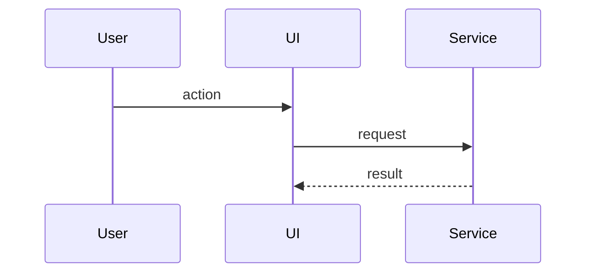

# [TDD Title]

### System Design

[Cross-component architecture: services, endpoints, schemas, queues, stores, external systems, and the delta from current behavior. Use takeaway-style subheadings and place diagrams or contracts next to the prose they support.]

#### [System takeaway title]

[Current behavior, target behavior, and boundary decision.]



### Program Design

[In-code structure: modules, call paths, component trees, dependency seams, internal signatures, pseudocode, and tests. Keep it selective; exhaustive task lists belong in the outline or plan.]

#### [Program takeaway title]

[Code-shape decision and rationale.]

```text
entrypoint
  validateInput
  applyChange
  reportResult
```

### What We're Not Doing

[Technical scope intentionally excluded. Remove this section if there is nothing meaningful to exclude.]

### Patterns to Follow

[Existing codebase patterns, with file locations and short snippets.]
