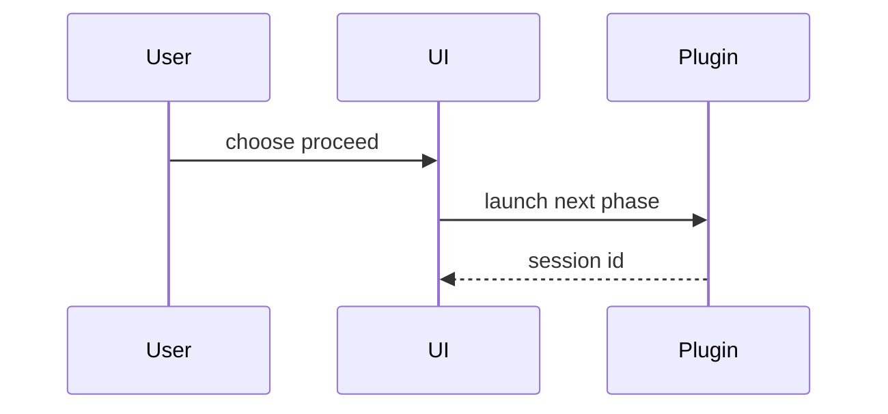

# Show Me

Help the user understand the current topic through the smallest useful visual. Keep prose short and place each visual next to the point it explains.

Use this skill for explanation, not implementation.

## Step 0: Load bb task context

Call `hl_task_context` before reading files. Use the returned task directory, task slug, artifact list, and artifact-save instructions.

If the user named an artifact with `@...`, read that artifact fully. If they ask about the current conversation only, use the conversation context and avoid opening unrelated task files.

## Choose the smallest visual that works

Use pseudocode for algorithms or decision logic:

```text
on(save)
  compare incoming content to stored content
  if unchanged, return the existing version
  persist the new version
  return the updated metadata
```

Use a call tree for runtime order:

```text
submitForm
  createTask
    persistPrompt
    launchThread
  openThread
```

Use a component tree for UI structure, state ownership, and module boundaries:

```tsx
<TaskDetail> (app/routes/task.tsx)
  useTaskArtifacts()
  <ArtifactTabs>
    <CommentRail />
```

Use a file tree for ownership across directories:

```text
src/
├── commands/       # parses command input
├── sessions/       # derives session state
└── artifacts/      # mirrors task files
```

Use Mermaid when relationships or message flow matter:



Use `diff` only when the before/after shape is the point. When most of the shape is new, show the complete target block instead.

## HTML artifact escape hatch

Create one HTML artifact when the topic is visual enough that text diagrams are insufficient: UI layout, state comparison, dense architecture map, or a concept that benefits from responsive rendering.

Use:

```text
references/show_me_template.md
```

as the artifact structure. If you write HTML, keep it self-contained, focused, responsive, and safe to preview. Match the product's existing colors, typography, spacing, and components when those are known. Use real labels and realistic data rather than placeholders when the task materials provide them.

Save visual artifacts under the task directory returned by `hl_task_context`. If a numbered artifact is appropriate, call `hl_next_artifact_number` and use:

```text
NN-show-me-<2-4-word-kebab-summary>.html
```

or `.md` when markdown is the better container.

After writing, call `hl_artifact_save` with the file name and keep the returned `::hl-artifact{...}` directive.

## Rules

- Do not create a visual artifact when a concise inline diagram answers the question.
- Do not open unrelated task artifacts.
- Do not produce a long essay before the visual.
- Do not use decorative diagrams that do not clarify ownership, order, state, or data.
- Do not invent product styles when the current design system is available in task materials.
- Do not write implementation plans unless the user asked for a plan.
- Do not stage, commit, or modify source files for this skill.

## Final response

If you saved an artifact, read:

```text
references/show_me_final_answer.md
```

Use that template only and include the artifact directive. The final response must end with exactly one fenced `text` block containing `/rpi-show-me`.

If no artifact was needed, answer directly with the visual and no next-step command.
